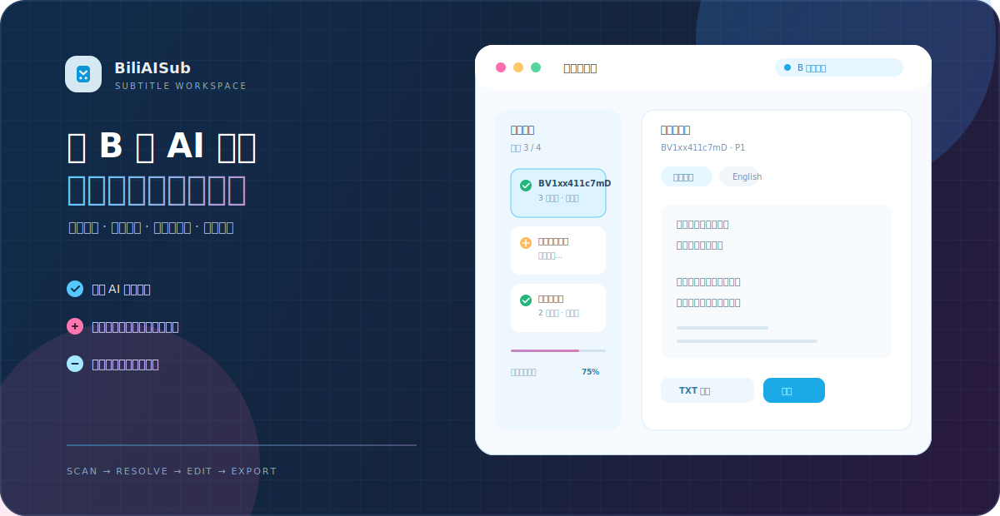
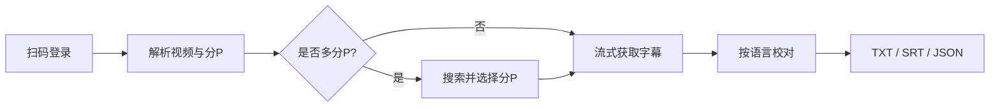
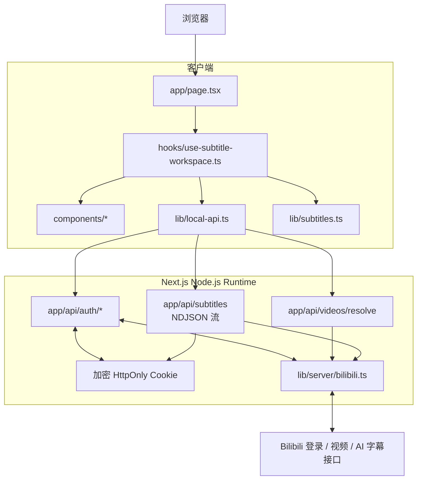

<div align="center">
  

  <p>
    
    
    
    
    
  </p>

  <p><strong>扫码登录 B 站，获取官方 AI 字幕，在线校对后导出。</strong></p>
</div>

## 这是什么？

BiliAISub 是一个 Next.js 全栈 TypeScript 应用，围绕“字幕工作流”而不是单次接口请求设计：从登录、解析、获取到编辑和导出，每一步都能看到当前状态，字幕按分 P 流式返回，先拿到的内容先进入编辑器。

### 适合做什么

| 能力 | 说明 |
| --- | --- |
| 批量解析 | 支持 BV 号、B 站视频链接和 `b23.tv` 短链接；单次最多 20 个输入，自动去重 |
| 分 P 选择 | 多分 P 视频可搜索、全选或清空，再按需获取字幕 |
| 流式字幕 | 服务端以 NDJSON 逐条推送结果，成功、无字幕、失败分别展示 |
| 多语言编辑 | 一次获取全部语言或指定语言，语言标签会保留当前页编辑状态 |
| 本页自动保存 | 修改立即保存在当前页面，切换视频或语言不会丢失；可随时恢复原文 |
| 灵活导出 | 当前语言、当前视频、全部成功字幕，均可导出 TXT / SRT / JSON |

## 工作流



## 架构设计



### 关键设计取舍

- 登录 Cookie 只在服务端读取，浏览器 JavaScript 只能得到账号摘要，不会接触 `SESSDATA` 等凭据。
- 字幕请求按分 P 顺序流式处理，并对同一分 P 的多语言轨道允许部分成功，避免一个语言失败拖垮全部结果。
- 前端请求支持 `AbortController`；重新解析、退出登录和卸载页面时会终止旧任务，避免过期响应覆盖新状态。
- API 对批量输入做去重和数量上限控制，视频解析并发限制为 4，字幕分 P 上限为 100。

## 本地启动

```powershell
pnpm install
pnpm dev
```

打开 <http://localhost:3000>。

生产环境建议使用 Node.js 22 和 pnpm 11。

## 环境变量

生产环境必须设置一串足够长的随机密钥：

```text
BILI_SUB_SESSION_SECRET=一串足够长的随机字符串
```

生成示例：

```powershell
node -e "console.log(require('crypto').randomBytes(32).toString('hex'))"
```

本地开发未设置时会使用仅供开发的默认值；不要将该默认值用于公开部署。

## 项目结构

```text
app/
  api/auth/                    扫码登录、状态检查、退出登录
  api/videos/resolve/          解析 BV / 视频链接 / 分P
  api/subtitles/               按分P流式返回字幕
  page.tsx                     工作台页面与交互编排
components/                   登录、输入、分P、编辑器、导出等 UI
hooks/
  use-subtitle-workspace.ts    请求生命周期与工作区状态
lib/
  local-api.ts                 前端 API 类型、取消和 NDJSON 读取
  limits.ts                    前后端共享的批量处理上限
  subtitles.ts                 字幕模型与纯函数
  server/bilibili.ts           B站接口、字幕解析、SRT 渲染
  server/request.ts            输入边界与并发控制
  server/session.ts             加密 HttpOnly Cookie 会话
public/readme-hero.svg         README 工作台视觉说明
```

## 常用命令

```powershell
pnpm typecheck
pnpm build
pnpm dev
```

## 部署到 Vercel

1. 在 Vercel 导入 GitHub 仓库 `Albert-PZY/BiliSub`。
2. Framework 选择 `Next.js`，Root Directory 保持项目根目录。
3. Install Command 使用 `pnpm install --frozen-lockfile`。
4. Build Command 使用 `pnpm build`。
5. 添加环境变量 `BILI_SUB_SESSION_SECRET` 后再部署。

项目已经包含 `vercel.json`，完整功能需要支持 Next.js Node.js 服务端运行时的平台。

## 导出说明

- TXT：使用当前页面中的编辑内容，适合整理成笔记或文稿。
- SRT：保留 B 站返回的原始时间轴和文本，不会把 TXT 的润色同步回时间轴。
- JSON：保留 B 站原始字幕结构，便于后续程序处理。

## 注意事项

- 字幕内容来自 B 站官方 AI 字幕，具体视频是否有字幕取决于 B 站返回结果。
- 请遵守 B 站服务条款与内容版权要求，仅处理你有权访问和使用的视频。
- 提交信息遵循约定式提交，详见 [`docs/git-commit-guidelines.md`](docs/git-commit-guidelines.md)。
