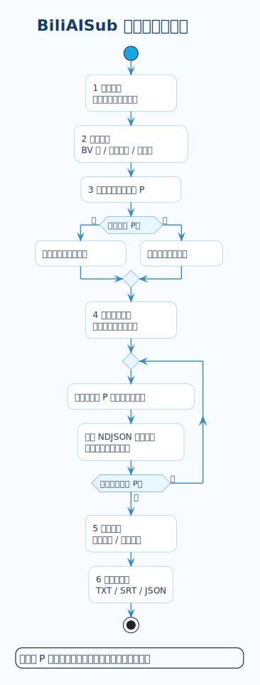
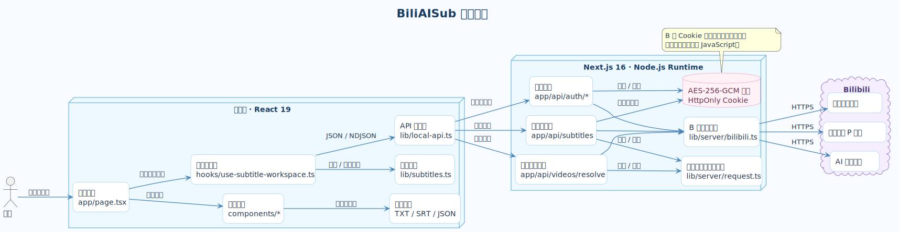

<div align="center">
  

  <p>
    
    
    
    
    
  </p>

  <p><strong>批量获取 B 站官方 AI 字幕，边获取、边校对、边交付。</strong></p>
  <p>
    <a href="https://bili-sub.vercel.app">在线使用</a>
    ·
    <a href="#本地运行">本地运行</a>
    ·
    <a href="#部署">部署</a>
  </p>
</div>

## 项目简介

BiliAISub 是一个面向完整字幕工作流的 Next.js 全栈应用。输入 BV 号、视频链接或 `b23.tv` 短链接后，它会解析视频与分 P，以 NDJSON 流逐条返回可用字幕，并提供多语言校对、原文恢复和批量导出。

应用使用服务端加密会话访问 B 站字幕接口。`SESSDATA` 等登录凭据只存在于加密的 HttpOnly Cookie 中，不会交给浏览器 JavaScript。

## 功能一览

| 能力 | 行为 |
| --- | --- |
| 批量解析 | 单次处理最多 20 个输入，支持 BV 号、完整链接和 B 站短链接，并自动去重 |
| 分 P 处理 | 多分 P 视频支持搜索、全选、清空和按需获取 |
| 流式反馈 | 每完成一个分 P 就立即更新界面，无需等待整批任务结束 |
| 多语言校对 | 获取全部语言或指定语言，切换视频与语言时保留页面内编辑内容 |
| 失败隔离 | 单条语言轨道失败不会拖垮同一视频的其他可用字幕 |
| 分级导出 | 按当前语言、当前视频或全部成功结果导出 TXT、SRT、JSON |

## 字幕处理工作流

<div align="center">
  
</div>

<p align="center"><sub>PlantUML 源文件：<a href="docs/diagrams/workflow.puml">docs/diagrams/workflow.puml</a></sub></p>

## 全栈架构

<div align="center">
  
</div>

<p align="center"><sub>PlantUML 源文件：<a href="docs/diagrams/architecture.puml">docs/diagrams/architecture.puml</a></sub></p>

### 设计要点

- **服务端会话**：B 站 Cookie 使用 AES-256-GCM 加密后写入 HttpOnly Cookie，前端只读取账号摘要。
- **请求生命周期**：重新解析、退出登录或卸载页面时通过 `AbortController` 终止旧请求，防止过期结果覆盖新状态。
- **输入边界**：视频输入和字幕分 P 均有去重与数量上限；视频信息以最多 4 个并发请求解析。
- **渐进式结果**：服务端按分 P 处理字幕，客户端消费 NDJSON 流并即时更新任务状态。
- **原始数据保护**：TXT 使用页面编辑内容；SRT 与 JSON 保留 B 站返回的原始时间轴和数据结构。

## 本地运行

### 环境要求

- Node.js 22
- pnpm 11

### 启动开发环境

```powershell
pnpm install
pnpm dev
```

访问 <http://localhost:3000>。

### 生产环境变量

公开部署必须配置强随机密钥：

```text
BILI_SUB_SESSION_SECRET=一串足够长的随机字符串
```

生成示例：

```powershell
node -e "console.log(require('crypto').randomBytes(32).toString('hex'))"
```

本地开发未配置时会使用仅供开发的默认值，该默认值不能用于生产环境。

## 常用命令

| 命令 | 用途 |
| --- | --- |
| `pnpm dev` | 启动本地开发服务器 |
| `pnpm typecheck` | 生成 Next.js 路由类型并执行 TypeScript 检查 |
| `pnpm build` | 创建生产构建 |
| `pnpm start` | 运行已生成的生产构建 |

<details>
<summary>重新渲染 PlantUML 图表</summary>

下载 `plantuml.jar` 后，在项目根目录运行：

```powershell
java "-Djava.awt.headless=true" -jar plantuml.jar -charset UTF-8 -tsvg -o "../../public/diagrams" "docs/diagrams/workflow.puml" "docs/diagrams/architecture.puml"
```

当前 SVG 使用 PlantUML 1.2026.6 生成。

</details>

## 项目结构

```text
app/
  api/auth/                    扫码登录、状态检查和退出登录
  api/videos/resolve/          解析 BV、视频信息与分 P
  api/subtitles/               按分 P 流式返回字幕
  page.tsx                     工作台页面与交互编排
components/                   登录、输入、分 P、编辑器和导出 UI
hooks/
  use-subtitle-workspace.ts    请求生命周期与工作区状态
lib/
  local-api.ts                 客户端 API、取消和 NDJSON 读取
  limits.ts                    前后端共享的批量处理上限
  subtitles.ts                 字幕模型与纯函数
  server/bilibili.ts           B 站接口、字幕解析和 SRT 渲染
  server/request.ts            输入边界与并发控制
  server/session.ts            加密 HttpOnly Cookie 会话
docs/diagrams/                PlantUML 图表源文件
public/diagrams/              README 使用的已渲染 SVG
public/readme-hero.svg         README 头图
```

## 部署

项目依赖 Next.js Node.js Runtime，推荐部署到 Vercel：

1. 在 Vercel 导入 GitHub 仓库 `Albert-PZY/BiliSub`。
2. Framework 保持 `Next.js`，Root Directory 保持仓库根目录。
3. Install Command 使用 `pnpm install --frozen-lockfile`。
4. Build Command 使用 `pnpm build`。
5. 添加 `BILI_SUB_SESSION_SECRET` 后部署。

仓库已包含 `vercel.json`。GitHub Pages 只能托管静态文件，无法运行本项目的登录、会话和字幕 API Routes。

## 使用边界

- 字幕是否可用取决于 B 站对具体视频返回的官方 AI 字幕。
- 请遵守 B 站服务条款和内容版权要求，仅处理你有权访问与使用的视频。
- 提交信息遵循约定式提交，详见 [`docs/git-commit-guidelines.md`](docs/git-commit-guidelines.md)。
