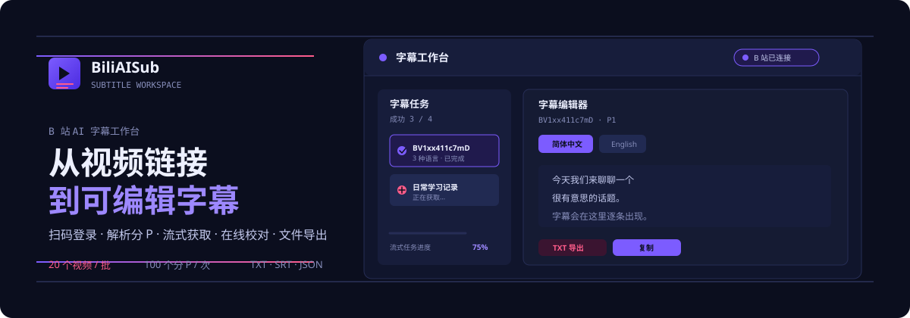
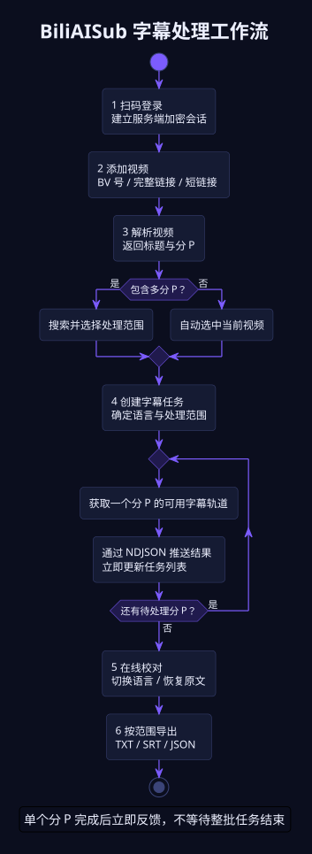
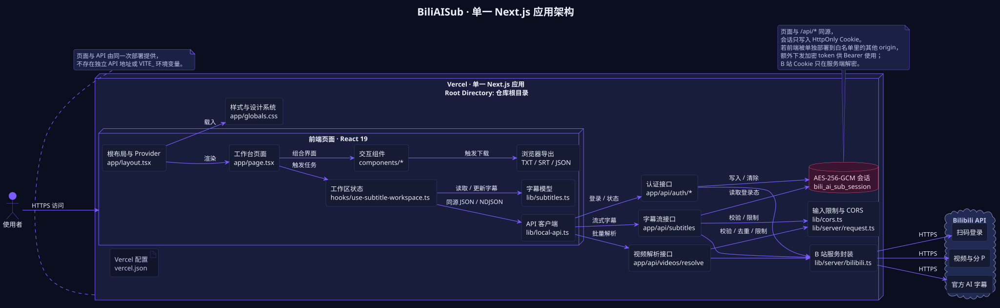

<div align="center">
  

  <p>
    
    
    
    
  </p>

  <p><strong>把 B 站官方 AI 字幕整理成可编辑、可导出的工作区。</strong></p>
  <p>Next.js 全栈应用 · NDJSON 流式反馈 · 加密会话 · 浏览器内校对</p>
  <p>
    <a href="#快速开始">快速开始</a>
    ·
    <a href="#部署">部署</a>
    ·
    <a href="#架构">架构</a>
  </p>
</div>

### 项目简介

BiliAISub 用于整理 B 站视频的官方 AI 字幕。输入 BV 号、完整视频链接或 `b23.tv` 短链接后，应用会解析视频与分 P；单 P 视频自动进入字幕获取，多 P 视频由使用者选择范围。字幕结果会逐条进入列表，可以切换语言、校对内容，并导出为 TXT、SRT 或 JSON。

应用是一个单一的 Next.js 全栈项目，前端页面与 `/api` 路由同源部署：

- **前端**：`app/page.tsx` 与 `components/`，负责工作区状态、字幕模型和文件下载。
- **API**：`app/api/*` 与 `lib/server/`，负责 B 站请求、扫码登录、会话保护、视频解析和 NDJSON 字幕流。

浏览器不会直接请求 B 站，也不会拿到 B 站登录 Cookie。同源部署让会话只依赖 HttpOnly Cookie，无需配置 API 域名或跨域白名单。

### 工作流

<div align="center">
  
</div>

<p align="center"><sub>源文件：<a href="docs/diagrams/workflow.puml">docs/diagrams/workflow.puml</a> · SVG：<a href="public/diagrams/workflow.svg">public/diagrams/workflow.svg</a></sub></p>

### 功能边界

| 能力 | 当前实现 |
| --- | --- |
| 视频输入 | 每批最多 20 个视频，支持 BV 号、完整链接和 `b23.tv` 短链接，输入会自动去重 |
| 分 P 处理 | 单 P 自动处理；多 P 视频支持搜索、全选、清空和按范围获取 |
| 字幕反馈 | API 通过 NDJSON 逐项返回结果，完成项会立即进入任务列表 |
| 多语言 | 支持全部语言、简体中文、繁体中文、英语、日语和韩语请求，并可在编辑区切换轨道 |
| 在线校对 | 直接编辑当前语言内容，可以恢复原文；编辑不会回写 B 站 |
| 文件导出 | 支持当前语言、当前视频和全部成功结果三种范围，输出 TXT、SRT、JSON |
| 失败隔离 | 单个视频、分 P 或语言轨道失败时保留其他结果，并显示对应错误 |

### 架构

<div align="center">
  
</div>

<p align="center"><sub>源文件：<a href="docs/diagrams/architecture.puml">docs/diagrams/architecture.puml</a> · SVG：<a href="public/diagrams/architecture.svg">public/diagrams/architecture.svg</a></sub></p>

```text
浏览器
  └─ Next.js 应用（Vercel，仓库根目录）
       ├─ /             React 工作台页面
       └─ /api/*        路由处理器：扫码登录、视频解析、NDJSON 字幕流
                          └─ 服务端携带 B 站 Cookie 请求 Bilibili
```

前端负责页面、工作区状态、字幕模型和文件下载；`app/api/*` 与 `lib/server/` 负责认证、视频解析、字幕获取、输入限制和加密会话。

### 会话与安全边界

- **会话存储**：登录成功后，B 站 Cookie 会被 AES-256-GCM 加密后写入 `bili_ai_sub_session` HttpOnly Cookie。JavaScript 只能读取账号摘要，不能读取 Cookie 内容。
- **令牌范围**：会话按最近更新时间滚动，最长 30 天；服务端才会解密其中的 B 站 Cookie。
- **跨域兜底**：若把前端单独部署到白名单里的其他 origin，可信来源会额外收到加密 session token，前端只把它放进当前标签页的 `sessionStorage`，再以 `Authorization: Bearer <token>` 请求 API。
- **来源控制**：同源部署不需要 CORS 配置；只有配置了 `BILI_SUB_ALLOWED_ORIGINS` 时，API 才会对精确匹配的 origin 返回 CORS 响应。不要把 `SESSDATA`、B 站 Cookie、API 密钥或 session token 提交到仓库。

### 快速开始

#### 环境要求

- Node.js 22.x
- pnpm 11.x

#### 本地启动

前端页面和 API 都在同一个 Next.js 进程里，只需要一条命令：

```bash
pnpm install --frozen-lockfile
pnpm dev
```

打开 <http://localhost:3000>。开发环境下会话密钥有内置的本地回退值，无需配置即可扫码登录。

#### 环境变量

在根目录创建 `.env.local`（Vercel 部署时改为配置同名 Project Environment Variable）：

```dotenv
# 生产环境必须设置为至少 32 字节的随机值；本地开发可留空
BILI_SUB_SESSION_SECRET=
# 仅当把前端部署到其他 origin 时才需要填写
BILI_SUB_ALLOWED_ORIGINS=
```

可以使用下面的命令生成会话密钥：

```bash
node -e "console.log(require('crypto').randomBytes(32).toString('hex'))"
```

完整示例见 [`.env.example`](.env.example)。这些是服务端变量，不要提交真实的 `BILI_SUB_SESSION_SECRET`。

### 部署

在 Vercel 导入仓库后保持默认设置即可，**Root Directory 必须是仓库根目录**：

1. 在 Vercel 导入仓库，Framework Preset 会自动识别为 Next.js。
2. 保持 `vercel.json` 的 `pnpm install --frozen-lockfile` 与 `pnpm build`。
3. 在 Project Environment Variables 中设置 `BILI_SUB_SESSION_SECRET` 为至少 32 字节的随机值。
4. 部署完成后访问首页。前端页面与 `/api/*` 同源，扫码登录、解析和字幕流都由同一个部署提供。

只有把前端拆到其他域名时，才需要额外配置 `BILI_SUB_ALLOWED_ORIGINS`。

### 常用命令

| 命令 | 作用 |
| --- | --- |
| `pnpm install --frozen-lockfile` | 按锁文件安装依赖 |
| `pnpm dev` | 启动 Next.js 开发服务器（页面与 API 同一进程） |
| `pnpm typecheck` | 生成 Next.js 路由类型并检查 TypeScript |
| `pnpm build` | 构建生产版本 |
| `pnpm start` | 启动生产服务器预览构建结果 |

### 项目结构

```text
.
├─ app/
│  ├─ page.tsx                  工作台页面与交互编排
│  ├─ layout.tsx                根布局与主题、Toast Provider
│  ├─ globals.css               Midnight Violet 设计系统
│  ├─ specs/page.tsx            工作区规格页
│  └─ api/                      同源路由处理器
│     ├─ auth/                  登录开始、轮询、状态与退出
│     ├─ videos/resolve/        视频和分 P 解析
│     └─ subtitles/             字幕获取与 NDJSON 流
├─ components/                  登录、输入、分 P、编辑器、导出与 UI
├─ hooks/use-subtitle-workspace.ts
├─ lib/
│  ├─ local-api.ts              API 客户端（同源 fetch 与 NDJSON 读取）
│  ├─ subtitles.ts              字幕模型与导出格式
│  ├─ limits.ts                 输入数量限制
│  ├─ cors.ts                   CORS 与跨域令牌边界
│  └─ server/                   B 站客户端、请求校验与会话
├─ public/                      静态资源与 README 图表
├─ docs/diagrams/               PlantUML 源文件
├─ .github/workflows/           CI 与 Release Please
├─ vercel.json                  Vercel 构建配置
└─ package.json                 依赖与脚本
```

### 限制与注意事项

- 单批最多处理 20 个视频，一次字幕获取最多处理 100 个分 P；前端提示限制，API 会再次校验。
- 每次部署只有一个应用，页面和 API 必须一起发布；B 站登录态保存在浏览器的加密 HttpOnly Cookie 中。
- 字幕是否可用取决于 B 站是否为具体视频返回官方 AI 字幕。本项目不生成，也不保证字幕内容。
- 项目不保存字幕任务数据库，不提供后台队列或长期账号托管；刷新或关闭页面不会把编辑内容同步到服务端。
- 请遵守 B 站服务条款、隐私规则和内容版权要求，只处理有权访问和使用的视频。
- 导出内容的准确性、完整性和后续使用责任由使用者承担。

### 图表源文件

PlantUML 源文件位于 [`docs/diagrams/`](docs/diagrams/)，对应 SVG 位于 [`public/diagrams/`](public/diagrams/)。仓库不包含 `plantuml.jar`，安装 Java 和 PlantUML 后，可以在根目录运行：

```bash
java -Djava.awt.headless=true -jar plantuml.jar -charset UTF-8 -tsvg -o ../../public/diagrams docs/diagrams/workflow.puml docs/diagrams/architecture.puml
```

重新生成后请检查 SVG 的 `title`、`desc`、文字大小、颜色和 `viewBox`，并确认没有引入远程字体、脚本或 `foreignObject`。

### 相关链接

- [工作区规格页](app/specs/page.tsx)
- [设计系统](design-system/biliaisub/MASTER.md)
- [Git 提交约定](docs/git-commit-guidelines.md)
- [项目仓库](https://github.com/Albert-PZY/BiliSub)
